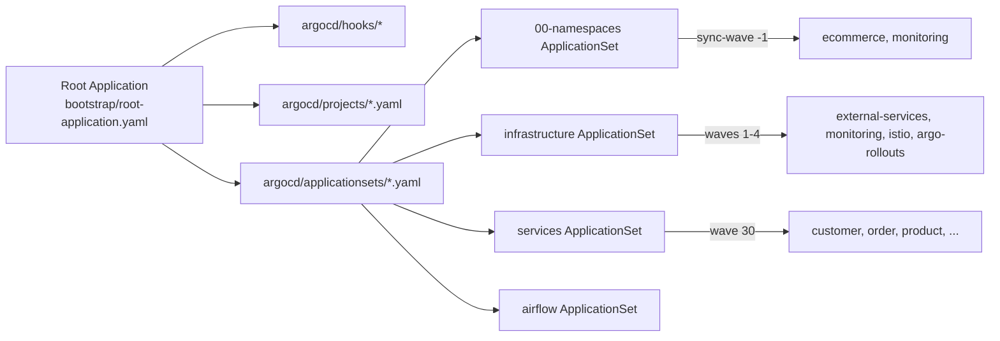

# App of Apps & ApplicationSet 구조

이 문서는 `c4ang-infra`에서 ArgoCD App of Apps 패턴과 ApplicationSet이 어떻게 결합되어 `dev`(k3d)와 `prod`(EKS) 환경을 동시에 관리하는지 설명합니다.

## 전체 개요
- **Root Application**: `bootstrap/root-application.yaml`은 ArgoCD 설치 직후 단 하나의 Application으로 적용되며, `argocd` 디렉터리의 `hooks/`, `projects/`, `applicationsets/`를 재귀적으로 동기화합니다.
- **ApplicationSet Controller 준비**: `argocd/hooks/wait-for-applicationset-controller.yaml` Job이 PreSync Hook으로 실행되어 ApplicationSet 컨트롤러가 Ready 상태가 되기 전까지 루트 동기화를 지연시킵니다.
- **환경 타깃**: 모든 ApplicationSet은 Matrix Generator를 사용해 `env ∈ {dev, prod}`와 컴포넌트 목록을 곱하여 Application을 생성합니다. `dev`는 `https://kubernetes.default.svc`, `prod`는 EKS API URL을 사용합니다.

## 구성도

## ApplicationSet과 Matrix Generator
ApplicationSet은 ArgoCD가 다수의 `Application`을 자동 생성하도록 도와주는 컨트롤러입니다. 이 프로젝트에서는 **Matrix Generator**를 사용해 여러 리스트를 조합하여 대상 애플리케이션을 만들고 있습니다.

### Matrix Generator란?
- 두 개 이상의 generator(주로 `list`)를 곱하여 가능한 모든 조합을 생성합니다.
- 예: `env ∈ {dev, prod}`와 `component ∈ {monitoring, istio}`를 곱하면 총 4개의 Application이 자동으로 만들어집니다.
- 각 조합은 별도의 `Application` 메타데이터, destination, valueFiles 등을 가집니다.

**장점**
1. 환경/컴포넌트/지역 등의 조합을 선언적으로 관리할 수 있어 스케일이 뛰어납니다.
2. 동일한 Helm 차트 구조를 재사용하면서 값 파일만 조합할 수 있으므로 중복을 줄입니다.
3. 새로운 환경을 추가할 때 generator 리스트에 한 항목만 넣으면 전체가 자동 확장됩니다.

**단점**
1. 조합 수가 많을수록 Application 개수가 폭발해 ArgoCD UI 관리가 복잡해질 수 있습니다.
2. 각 조합에 대한 예외 처리가 어렵기 때문에, 특이 케이스는 별도 Application으로 분리해야 합니다.
3. 실수로 값을 잘못 지정하면 dev/prod 모두에 영향을 줄 수 있어 리뷰와 테스트가 필수입니다.

## ApplicationSet 세부 구조
| 파일 | Generator | 대상 | Sync Wave / 목적 |
|------|-----------|------|------------------|
| `00-namespaces.yaml` | List (env) | `argocd/manifest/namespaces.yaml` Application | `-1` – 네임스페이스 생성 및 `istio-injection` 라벨 |
| `infrastructure.yaml` | Matrix(`env` × `external-services`, `monitoring`, `istio`, `argo-rollouts`) | Helm 차트 `charts/<component>` + `config/<env>/<component>.yaml` | `1~4` – 데이터 계층, 관측성, Istio, Argo Rollouts 순 배포 |
| `services.yaml` | Matrix(`env` × 서비스 목록) + Multiple Sources | Helm 차트 `charts/services/<name>` + `config/<env>/<name>.yaml` | `30` – 애플리케이션 배포, Istio 사이드카 자동 주입 |
| `airflow.yaml` | Matrix(`env` × airflow) | `charts/airflow` + `config/<env>/airflow.yaml` | `10` – 데이터 파이프라인 인프라(필요 시) |

각 Application에는 `app.kubernetes.io/env` 라벨과 `argocd.argoproj.io/sync-wave` 어노테이션이 부여되어, dev/prod 상태를 동시에 추적하고 순차적으로 동기화할 수 있습니다.

## App of Apps + ApplicationSet 동작 흐름
1. **부트스트랩**: `bootstrap/install-argocd.sh`가 ArgoCD를 설치하고 Root Application을 적용합니다.
2. **Hook 실행**: PreSync Hook Job이 ApplicationSet 컨트롤러가 Ready한지 확인합니다.
3. **Project 배포**: `argocd/projects/*.yaml`이 먼저 적용되어 `infrastructure`, `applications` 등 권한 경계를 정의합니다.
4. **ApplicationSet 배포**: Root Application이 `argocd/applicationsets/*.yaml`을 생성합니다.
5. **Matrix 확장**: 각 ApplicationSet이 `dev`와 `prod`에 대한 Application을 자동 생성하고, 지정된 Sync Wave에 따라 네임스페이스 → 인프라 → 마이크로서비스 순으로 리소스를 배포합니다.
6. **Self-Heal**: ArgoCD가 `automated.prune + selfHeal` 정책으로 두 환경의 Drift를 감지하고 자동 복구합니다.

## 장점
1. **단일 진입점**: Root Application 하나로 Projects, Hooks, ApplicationSets를 모두 배포하므로 신규 클러스터 부트스트랩이 단순합니다.
2. **환경 스케일링 용이**: Matrix Generator 덕분에 새로운 환경을 추가할 때 `env` 요소만 정의하면 동일한 차트/값 조합이 자동으로 확장됩니다.
3. **정렬된 배포 순서**: Sync Wave와 App of Apps 결합으로 네임스페이스 → 인프라 → 서비스 순서가 항상 보장되어 의존성 충돌을 예방합니다.
4. **구성 가시성**: `argocd/projects`와 Application 라벨을 통해 `dev`/`prod` 상태를 하나의 ArgoCD UI에서 비교할 수 있습니다.

## 단점
1. **초기 복잡성**: Root Application 한 번에 Hooks/Projects/ApplicationSet을 모두 적용하기 때문에 YAML 구조가 복잡하며 디버깅이 어렵습니다.
2. **컨트롤러 의존성**: ApplicationSet 컨트롤러가 준비되지 않으면 전체 동기화가 지연됩니다(이를 완화하기 위해 Hook Job을 사용하지만 추가 자원이 필요).
3. **동시 변경 리스크**: App of Apps 범위가 크므로 잘못된 커밋이 dev와 prod 모두에 확산될 수 있어, 브랜치 전략과 리뷰 절차가 필수입니다.
4. **Sync Wave 관리 부담**: 새로운 컴포넌트를 추가할 때 적절한 Wave를 지정하지 않으면 배포 순서가 꼬일 수 있어, 문서화와 리뷰가 필요합니다.

이 구조는 선언적 관리와 환경 간 일관성을 극대화하지만, 변경은 항상 Root Application에서 파급되므로 PR 검증과 ArgoCD 모니터링을 병행해야 합니다.
