# 프로젝트 설계도

이 문서는 `c4ang-infra` 저장소가 어떻게 쇼핑몰 웹서비스 인프라를 설계·구성하는지 설명합니다. 개발 환경은 `k3d` 기반 로컬 Kubernetes(`dev`), 운영 환경은 AWS EKS(`prod`)를 표준으로 하며, 동일한 Helm 차트와 GitOps 파이프라인을 공유합니다.

## 기술 스택 개요
- **컨테이너 플랫폼**: k3d(Kubernetes in Docker) / Amazon EKS
- **배포 & GitOps**: ArgoCD App of Apps + ApplicationSet, Helm, Argo Rollouts
- **네트워킹 & 메시**: Istio Gateway, VirtualService, DestinationRule
- **데이터 & 외부 연동**: Strimzi Kafka, Redis/PostgreSQL StatefulSet 템플릿, External Services 차트
- **관측성**: Prometheus, Grafana, Loki, Tempo, k6 성능 시험
- **자동화 & 보안**: Makefile, Bash 스크립트, SOPS + Age, External Secrets + AWS Secrets Manager

## 레포지토리 구조
```
scripts/bootstrap/    # k3d 부트스트랩 (dev.sh, create-cluster.sh, start/stop)
scripts/platform/     # ArgoCD, Istio, Kafka, Monitoring, Secrets 운영 스크립트
charts/               # 환경 중립 Helm 차트 (monitoring, istio, services/*, statefulset-base/*)
config/dev|prod/      # 환경별 values (리소스 크기, 시크릿 참조, 트래픽 정책)
argocd/projects/      # ArgoCD Project 경계 정의
argocd/applicationsets/ # Matrix 패턴(ApplicationSet) 정의
environments/dev|prod/  # dev kubeconfig & docs, prod ExternalSecret 매니페스트
performance-tests/    # k6 시나리오, 실행 스크립트
bootstrap/            # install-argocd.sh, root-application.yaml(App of Apps)
```

## 아키텍처 동작 방식
1. **로컬/운영 클러스터 준비**
   - `dev`: `make dev-init`으로 Docker, k3d 클러스터, ECR 인증을 구성하고 `environments/dev/kubeconfig/config`를 export 합니다.
   - `prod`: `argocd/applicationsets/*.yaml`에 명시된 EKS API 서버 URL을 사용하여 동일한 ApplicationSet이 운영 클러스터에 배포됩니다.

2. **ArgoCD App of Apps 패턴**
   - `bootstrap/install-argocd.sh`가 ArgoCD를 설치한 뒤, `bootstrap/root-application.yaml`(App of Apps)이 `argocd/projects`와 `argocd/applicationsets` 전체를 단일 루트 Application으로 관리합니다.
   - App of Apps는 먼저 Project 정의를 배포해 역할과 네임스페이스 경계를 확정하고, 이어서 ApplicationSet 리소스를 동기화하여 `dev`/`prod` Application을 자동 생성합니다.

3. **ApplicationSet Matrix 패턴**
   - `infrastructure` ApplicationSet은 `(env ∈ {dev, prod}) × (external-services, monitoring, istio, argo-rollouts)` 조합을 생성하며 각 Application에 `sync-wave`를 부여해 의존 순서를 보장합니다.
   - `services` ApplicationSet은 `(env ∈ {dev, prod}) × (customer, order, product, …)` 조합을 생성하고 Multiple Sources로 `charts/services/<name>` + `config/<env>/<name>.yaml`을 결합합니다.

4. **Sync Wave 기반 초기화 순서**
   - **Wave -1 – 네임스페이스/라벨**
     - `argocd/applicationsets/00-namespaces.yaml` → `argocd/manifest/namespaces.yaml`
     - 자원: `Namespace/ecommerce`, `Namespace/monitoring`
     - 목적: 서비스 및 인프라 배포를 위한 격리 공간과 `istio-injection=enabled` 라벨을 선행 적용
   - **Wave 1 – External Services**
     - 차트: `charts/external-services`
     - 자원: 데이터베이스/Redis/PostgreSQL StatefulSet, Kafka 접속 Secret, 필요한 ConfigMap, ServiceAccount
     - 목적: 마이크로서비스가 의존하는 저장소·메시징 레이어 선 배치
   - **Wave 2 – Monitoring Stack**
     - 차트: `charts/monitoring`
     - 자원: Prometheus Operator, Grafana, Loki, Tempo, exporters
     - 목적: 이후 배포되는 자원에 대한 관측 가능성 확보 및 Alerting 기반 마련
   - **Wave 3 – Istio**
     - 차트: `charts/istio`
     - 자원: Istio Gateway, VirtualService, DestinationRule, PeerAuthentication 등
     - 목적: 트래픽 제어·서비스 메시 정책을 인프라·서비스 앞단에 구성
   - **Wave 4 – Argo Rollouts**
     - 차트: `charts/argo-rollouts`
     - 자원: Argo Rollouts 컨트롤러, 분석 템플릿
     - 목적: 서비스 롤아웃 시 블루/그린·카나리 전략을 활성화하고 Istio와 연동
   - **Wave 30 – 마이크로서비스**
     - ApplicationSet: `services`
     - 자원: Helm 차트 `charts/services/<name>` (Deployment/Rollout, Service, HPA, ConfigMap 등)
     - 대상 서비스: customer, order, payment, product, recommendation, saga-tracker, store
     - 목적: 모든 인프라 계층이 준비된 후 애플리케이션을 배포하며, Istio 사이드카가 자동 주입되어 메시 정책을 준수

5. **Values 계층**
   - 공통 기본값은 `charts/**/values.yaml`, `dev`/`prod` 차이는 `config/dev|prod/<component>.yaml`에 육안으로 분리합니다.
   - `config/<env>/*.secrets.enc.yaml`만 Git에 올리고 SOPS + Age로 복호화합니다.

6. **운영 및 변경 흐름**
   - 변경은 Helm 소스 또는 ApplicationSet 정의에 적용되며, ArgoCD가 자동으로 `dev`와 `prod`에 Sync합니다.
   - Drift가 발생하면 ArgoCD가 `selfHeal` 정책으로 복구하며, 필요 시 `argocd app sync <name>`로 수동 동기화합니다.
   - 모니터링·카프카 등 핵심 플랫폼 자원은 `scripts/platform/*.sh`로 개별 설치/상태 점검을 수행할 수 있으나, 최종 상태는 ArgoCD가 유지합니다.

## 최초 부트스트랩 시나리오

```mermaid
flowchart TD
    subgraph Dev[k3d dev]
        A1[make install-tools] --> A2[make dev-init<br/>k3d cluster + ECR + ArgoCD]
        A2 --> A3[run bootstrap/install-argocd.sh]
        A3 --> A4[apply root-application.yaml]
        A4 --> A5[ArgoCD sync-wave: namespaces → infra → services]
        A5 --> A6[make dev-status / kubectl msa-quality]
    end
    subgraph Prod[EKS prod]
        B1[install ArgoCD via bootstrap/install-argocd.sh] --> B2[apply root-application.yaml in argocd ns]
        B2 --> B3[ApplicationSets use prod cluster URL + config/prod values]
        B3 --> B4[Sync-wave deploy namespaces → infra → services]
        B4 --> B5[External Secrets pulls AWS Secrets Manager → Kubernetes Secret]
    end
```


1. **`dev` (k3d)**
   1. `make install-tools` (필요 시)로 Docker/k3d/kubectl/helm 확인
   2. `make dev-init` → k3d 클러스터 생성, ECR Secret, ArgoCD 설치
   3. `bootstrap/install-argocd.sh` 실행 시 `bootstrap/root-application.yaml` 적용
   4. ArgoCD가 sync-wave 순서로 네임스페이스 → 인프라 → 서비스 순으로 배포
   5. `make dev-status` 및 `kubectl --kubeconfig=environments/dev/kubeconfig/config get pods -n msa-quality`로 상태 검증

2. **`prod` (EKS)**
   1. EKS 클러스터에서 `bootstrap/install-argocd.sh`를 실행하고 `root-application.yaml`을 `argocd` 네임스페이스에 적용
   2. `argocd/applicationsets/*.yaml`의 `cluster` URL과 `config/prod/*.yaml` 값이 사용되어 동일한 Sync Wave 순서로 자원이 생성
   3. External Secrets 컨트롤러가 `environments/prod/secrets/`에 선언된 매니페스트를 통해 AWS Secrets Manager 값을 Kubernetes Secret으로 주입

## 운영 팁
- **네임스페이스/사이드카**: Wave -1에서 라벨이 누락되면 Istio 사이드카가 주입되지 않으므로 `kubectl get namespace ecommerce --show-labels`를 우선 확인합니다.
- **Sync Wave 문제**: `kubectl get applications -n argocd -o jsonpath='{range .items[*]}{.metadata.name}{"\t"}{.metadata.annotations.argocd\.argoproj\.io/sync-wave}{"\n"}{end}' | sort -k2 -n`으로 순서를 재검증합니다.
- **Values 변경**: dev에서 `config/dev/<component>.yaml`을 수정해 검증 후 prod에 동일 변경을 `config/prod/`에 복제하고 PR에 승격 계획을 기록합니다.
- **시크릿 관리**: `make sops-setup`으로 Age 키를 생성하고 `make sops-encrypt FILE=<path>`로 암호화 파일만 커밋합니다.
- **성능 검증**: ArgoCD Sync 후 `make perf-smoke` 또는 `make perf-load SERVICE=product`로 회귀 검증을 수행하고 결과를 `performance-tests/results/`에서 확인합니다.

이 설계도를 참조하면 k3d와 EKS 모두에서 동일한 선언적 인프라를 재현할 수 있으며, App of Apps + ApplicationSet 패턴을 통해 환경별 차이를 최소한의 값 파일로 관리할 수 있습니다.
