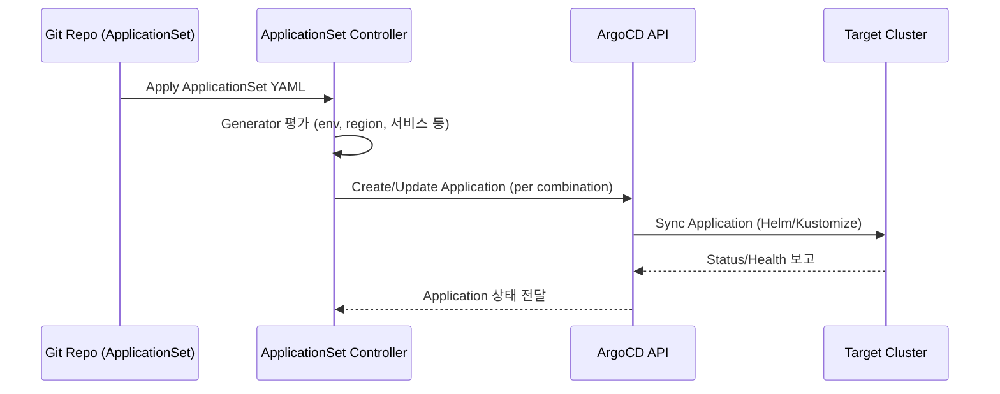

# ArgoCD ApplicationSet 가이드

> 참고: [ArgoCD 공식 문서 – ApplicationSet](https://argo-cd.readthedocs.io/en/stable/operator-manual/applicationset/), [Generators](https://argo-cd.readthedocs.io/en/stable/operator-manual/applicationset/Generators/)

ApplicationSet은 하나의 템플릿으로 다수의 `Application` 객체를 동적으로 생성하는 컨트롤러입니다. 시니어 백엔드 개발자가 환경/테넌트/서비스 규모를 확장할 때 필요한 개념, 흐름, 장단점을 정리합니다.

## 핵심 개념
- **Generator**: 리스트(list), Git 디렉토리, 클러스터 목록 등에서 파생된 값을 사용해 Application 인스턴스를 만듭니다.
- **템플릿**: 일반 Application spec과 동일하지만 변수(`{{ }}`)를 포함하며, generator가 공급한 값을 치환합니다.
- **동기화 전략**: ApplicationSet도 `syncPolicy.automated`를 지정할 수 있고, 하위 Application은 자신의 sync 정책을 따릅니다.

## 동작 흐름

1. Git에 ApplicationSet YAML을 커밋/적용하면 컨트롤러가 Generator를 평가합니다.
2. Generator 결과(예: `env=dev, component=monitoring`)마다 템플릿을 채워 개별 Application을 생성하거나 업데이트합니다.
3. 각 Application은 자신만의 Sync 정책, destination, valueFiles를 갖고 Helm/Kustomize로 리소스를 배포합니다.
4. ApplicationSet은 Application 상태를 관찰하여 필요한 경우 재생성/정리(`syncPolicy.applicationsSync`)를 수행합니다.

## Matrix Generator
- **정의**: 두 개 이상 generator를 곱해 가능한 모든 조합을 생성합니다.
- **사용 예시**: 환경 목록 × 서비스 목록 → `env-service` 조합을 자동 생성.
- **장점**:
  1. 환경 확장 시 generator에 항목을 추가하는 것만으로 규모가 선형적으로 늘어납니다.
  2. 차트 재사용성과 값 분리(예: `charts/services/<name>` + `config/<env>/<name>.yaml`)가 쉬워집니다.
  3. Sync Wave, Label 등을 조합별로 주입하여 세밀한 제어가 가능합니다.
- **단점**:
  1. 조합 수가 많으면 Application 수가 폭발하여 관리 복잡도가 증가합니다.
  2. 특이 케이스를 처리하기 어렵고, 예외는 별도 Application으로 분리해야 합니다.
  3. 잘못된 generator 값이 동시에 여러 환경에 영향을 주므로 리뷰와 테스트가 필수입니다.

## 장점
1. **규모 확장**: 수십 개의 서비스/환경을 선언적으로 관리할 수 있습니다.
2. **일관성**: 모든 Application이 동일한 템플릿을 공유하므로 배포 규칙이 통일됩니다.
3. **자동 정리**: Generator에서 항목을 제거하면 관련 Application이 자동으로 pruned 됩니다(`applicationsSync: create-update` 등).

## 단점 / 고려 사항
1. **컨트롤러 의존성**: ApplicationSet Controller가 정상 동작해야 Application 생성이 가능하므로 모니터링이 필요합니다.
2. **에러 파급력**: 템플릿 오류가 다수의 Application에 전파되어 대규모 장애로 이어질 수 있습니다.
3. **디버깅 난이도**: Generator 결과와 템플릿 치환 값을 확인해야 해서 일반 Application보다 추적이 복잡합니다.

## 실무 팁
- Generator 리스트는 YAML 주석으로 용도와 요구사항을 설명하고, 값 파일은 `config/<env>/<component>.yaml`처럼 경로 규칙을 통일하세요.
- Sync Wave를 적극적으로 활용해 네임스페이스 → 인프라 → 앱 순서를 보장합니다.
- `applicationsSync` 정책을 `create-update` 또는 `create-only`로 명시하여 ApplicationSet이 어떻게 Application을 갱신할지 결정하세요.
- CI 단계에서 `argocd-util appset list` 혹은 `argocd app list`로 생성 결과를 검증해 배포 전에 오류를 조기 감지합니다.

ApplicationSet은 App of Apps 패턴과 함께 사용할 때 로컬(k3d)와 운영(EKS) 환경을 동시에 선언적으로 관리할 수 있는 강력한 도구입니다. 공식 레퍼런스를 참고해 각 조직의 환경/컴포넌트 목록에 맞는 Generator 조합을 설계하세요.
