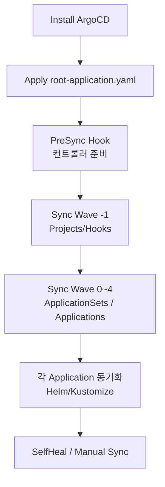

# ArgoCD App of Apps 패턴 가이드

> 참고: [ArgoCD 공식 문서 – App of Apps Pattern](https://argo-cd.readthedocs.io/en/stable/operator-manual/cluster-bootstrapping/)

시니어 백엔드 개발자가 인프라 부트스트랩 구조를 이해할 수 있도록 App of Apps(App-of-Apps) 패턴의 개념, 동작 흐름, 순서를 요약합니다. 이 패턴은 **하나의 “루트 Application”** 이 여러 하위 Application 또는 ApplicationSet을 선언적으로 소유하여 클러스터 전체를 구성하는 방식입니다.

## 핵심 개념
- **루트 Application**: Git 리포지토리의 특정 디렉터리를 소스(path)로 삼아 다수의 YAML(Projects, Application, ApplicationSet 등)을 재귀적으로 적용합니다.
- **Sync Wave & Hook**: 루트 Application도 다른 Application과 동일하게 `argocd.argoproj.io/sync-wave`, Hooks(PreSync/PostSync)를 사용할 수 있습니다. 이를 통해 하위 리소스의 배포 순서를 제어합니다.
- **불변의 단일 진입점**: 클러스터에 ArgoCD만 설치되어 있다면 `kubectl apply -f root-application.yaml` 한 번으로 전체 리소스가 선언적으로 복원됩니다.

## 동작 흐름
1. **ArgoCD 설치** – Helm 혹은 manifests로 ArgoCD 컨트롤 플레인을 배포합니다.
2. **Root Application 적용** – `kubectl apply -f root-application.yaml -n argocd`.
3. **Hook & Dependency 준비** – 필요 시 Root Application의 PreSync Hook이 CRD/컨트롤러 준비 여부를 확인합니다.
4. **Projects 배포** – sync wave가 낮은 YAML부터 적용되어 RBAC 경계를 형성합니다.
5. **하위 Application / ApplicationSet 배포** – 루트가 가리키는 디렉터리 내의 정의를 차례대로 적용합니다.
6. **하위 Application 동기화** – 각 Application이 자신의 helm/kustomize 소스를 동기화하고, 필요 시 추가 Sync Wave 규칙을 사용합니다.
7. **Self-Heal** – 루트 또는 자식 Application 모두 `syncPolicy.automated.selfHeal`을 사용할 수 있어 드리프트를 자동 복원합니다.

## 순차적 제어 예시

## 장점
1. **재현성** – 단일 선언으로 전체 인프라를 부트스트랩할 수 있어 신규 클러스터 준비가 빠릅니다.
2. **구성 일관성** – Root Application이 참조하는 Git 트리 구조와 실제 배포 구조를 대응시키므로 변경 히스토리가 명확합니다.
3. **순차 제어** – Sync Wave, Hook을 활용해 네임스페이스 → CRD → 애플리케이션 순으로 안정적으로 배포할 수 있습니다.

## 단점 / 고려 사항
1. **Blast Radius** – 루트 Application 변경이 곧 전체 스택에 영향을 주므로 리뷰와 테스트가 필수입니다.
2. **복잡도 증가** – 재귀적으로 배포하는 YAML이 많을수록 디버깅이 어렵고, 일부 리소스를 선별적으로 비활성화하기 힘듭니다.
3. **컨트롤러 의존성** – 루트 Application이 ApplicationSet 등 추가 컨트롤러에 의존한다면 Hook을 추가해 준비 상태를 보장해야 합니다.

## 실무 팁
- Root Application의 source path는 **명확한 서브디렉터리**로 제한하여 예상치 못한 YAML이 적용되지 않도록 합니다.
- Sync Wave 주석을 남겨 유지보수성을 높이고, Hook Job에는 짧은 TTL과 실패 시 재시도를 설정합니다.
- 운영/개발 환경을 동일 루트에서 관리하되, 환경별 ApplicationSet/Project를 분리해 Blast Radius를 줄일 수 있습니다.

이 가이드는 App of Apps 패턴을 이해하고 자체 부트스트랩 프로세스를 설계하려는 시니어 개발자를 대상으로 합니다. 공식 문서를 참고하면서 자신들의 저장소 구조와 정책에 맞게 루트 Application을 구성하세요.
