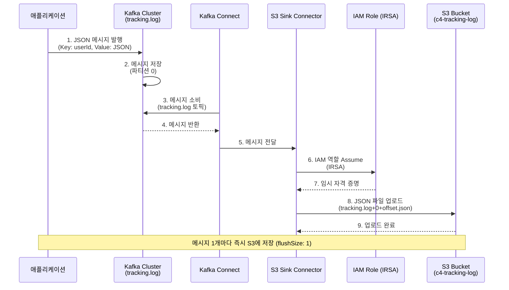
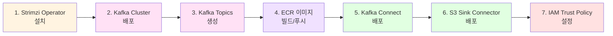
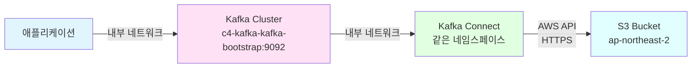

# Kafka Connect S3 Sink Connector 아키텍처

## 전체 시스템 아키텍처

```mermaid
graph TB
    subgraph "애플리케이션 레이어"
        App1[애플리케이션 1<br/>Java/Spring]
        App2[애플리케이션 2<br/>Python/Node.js]
        App3[기타 애플리케이션]
    end

    subgraph "Kubernetes Cluster (EKS)"
        subgraph "Kafka Namespace"
            subgraph "Strimzi Operator"
                SO[Strimzi Operator<br/>관리자]
            end
            
            subgraph "Kafka Cluster (c4-kafka)"
                K1[Kafka Broker 1]
                K2[Kafka Broker 2]
                K3[Kafka Broker 3]
                Topic[Kafka Topic<br/>tracking.log]
            end
            
            subgraph "Kafka Connect"
                KC[Kafka Connect<br/>c4-kafka-connect]
                Connector[S3 Sink Connector<br/>s3-sink-connector]
            end
            
            subgraph "Kafka UI"
                UI[Kafka UI<br/>Web Interface<br/>Port 8080]
            end
        end
        
        subgraph "ECR"
            ECR[ECR Registry<br/>kafka-connect-s3:latest]
        end
    end

    subgraph "AWS Services"
        subgraph "IAM"
            IAM[IAM Role<br/>IRSA<br/>S3 접근 권한]
        end
        
        subgraph "S3"
            S3[S3 Bucket<br/>c4-tracking-log<br/>ap-northeast-2]
            Files[JSON Files<br/>topics/tracking.log/partition=0/]
        end
    end

    App1 -->|Producer| Topic
    App2 -->|Producer| Topic
    App3 -->|Producer| Topic
    
    SO -.->|관리| K1
    SO -.->|관리| K2
    SO -.->|관리| K3
    SO -.->|관리| KC
    
    K1 --> Topic
    K2 --> Topic
    K3 --> Topic
    
    Topic -->|Consume| KC
    KC --> Connector
    Connector -->|Write| S3
    
    KC -.->|Pull Image| ECR
    KC -.->|Assume Role| IAM
    IAM -.->|권한| S3
    
    UI -->|Monitor| Topic
    UI -->|Monitor| KC
    UI -->|Monitor| Connector
    
    S3 --> Files

    style App1 fill:#e1f5ff
    style App2 fill:#e1f5ff
    style App3 fill:#e1f5ff
    style SO fill:#fff4e1
    style K1 fill:#ffe1f5
    style K2 fill:#ffe1f5
    style K3 fill:#ffe1f5
    style Topic fill:#ffe1f5
    style KC fill:#e1ffe1
    style Connector fill:#e1ffe1
    style UI fill:#ffe1ff
    style ECR fill:#f0e1ff
    style IAM fill:#ffe1e1
    style S3 fill:#e1ffff
    style Files fill:#e1ffff
```

## 데이터 흐름 다이어그램



## 컴포넌트 상세

### 1. 애플리케이션 레이어
- **역할**: Kafka Producer로 메시지 발행
- **지원 언어**: Java, Python, Node.js, Kotlin 등
- **토픽**: `tracking.log`
- **메시지 형식**: JSON (Key: String, Value: JSON)

### 2. Strimzi Operator
- **역할**: Kafka Cluster 및 Kafka Connect 관리
- **버전**: latest (0.48.0)
- **관리 대상**:
  - Kafka Cluster (c4-kafka)
  - Kafka Connect (c4-kafka-connect)
  - Kafka Topics

### 3. Kafka Cluster (c4-kafka)
- **Broker 수**: 3개
- **버전**: Kafka 4.1.0
- **토픽**: `tracking.log` (파티션 1개)
- **네임스페이스**: `kafka`

### 4. Kafka Connect
- **클러스터명**: `c4-kafka-connect`
- **이미지**: ECR에서 커스텀 이미지 사용
  - Base: `quay.io/strimzi/kafka:0.48.0-kafka-4.1.0`
  - 플러그인: Confluent S3 Sink Connector 10.6.11
- **ECR**: `963403601423.dkr.ecr.ap-northeast-2.amazonaws.com/kafka-connect-s3:latest`

### 5. S3 Sink Connector
- **이름**: `s3-sink-connector`
- **클래스**: `io.confluent.connect.s3.S3SinkConnector`
- **설정**:
  - `topics`: `tracking.log`
  - `flushSize`: 1 (메시지 1개마다 저장)
  - `formatClass`: JSON Format
  - `s3BucketName`: `c4-tracking-log`

### 6. IAM 역할 (IRSA)
- **역할명**: `eksctl-c4-eks-cluster-addon-iamserviceaccount-Role1-YQcLCkIlCmbK`
- **ServiceAccount**: `c4-kafka-connect-connect`
- **권한**: S3 버킷 (`c4-tracking-log`)에 대한 읽기/쓰기 권한
- **인증 방식**: IRSA (IAM Roles for Service Accounts)

### 7. S3 Bucket
- **버킷명**: `c4-tracking-log`
- **리전**: `ap-northeast-2` (서울)
- **파일 경로**: `topics/tracking.log/partition=0/`
- **파일 형식**: JSON Lines (한 줄에 하나의 JSON 객체)
- **파일명 형식**: `{topic}+{partition}+{offset}.json`

## 배포 순서



## 보안 아키텍처

```mermaid
graph TB
    subgraph "Kubernetes"
        Pod[Kafka Connect Pod]
        SA[ServiceAccount<br/>c4-kafka-connect-connect]
    end
    
    subgraph "AWS IAM"
        Role[IAM Role<br/>S3 접근 권한]
        Policy[S3 Policy<br/>PutObject, ListBucket]
    end
    
    subgraph "OIDC"
        OIDC[EKS OIDC Provider]
    end
    
    Pod -->|annotations| SA
    SA -->|Trust Policy| OIDC
    OIDC -->|Assume Role| Role
    Role -->|권한| Policy
    Policy -->|접근| S3[S3 Bucket]
    
    style Pod fill:#e1ffe1
    style SA fill:#e1ffe1
    style Role fill:#ffe1e1
    style Policy fill:#ffe1e1
    style OIDC fill:#fff4e1
    style S3 fill:#e1ffff
```

## 파일 저장 구조

```
s3://c4-tracking-log/
└── topics/
    └── tracking.log/
        └── partition=0/
            ├── tracking.log+0+0000000000.json
            ├── tracking.log+0+0000000001.json
            ├── tracking.log+0+0000000002.json
            └── ...
```

각 파일 내용:
```json
{"userId":"user-123","eventType":"page_view","timestamp":"2024-01-15T10:30:00Z","page":"/products/123"}
```

## 네트워크 흐름



## 주요 설정 값

| 컴포넌트 | 설정 항목 | 값 |
|---------|----------|-----|
| Kafka Cluster | 이름 | `c4-kafka` |
| Kafka Cluster | 버전 | `4.1.0` |
| Kafka Cluster | Broker 수 | `3` |
| Kafka Topic | 이름 | `tracking.log` |
| Kafka Topic | 파티션 | `1` |
| Kafka Connect | 클러스터명 | `c4-kafka-connect` |
| Kafka Connect | 이미지 | `kafka-connect-s3:latest` |
| S3 Connector | 토픽 | `tracking.log` |
| S3 Connector | 버킷 | `c4-tracking-log` |
| S3 Connector | 리전 | `ap-northeast-2` |
| S3 Connector | flushSize | `1` |
| IAM Role | ARN | `arn:aws:iam::963403601423:role/...` |

## 참고 자료

- [AI 개발자 가이드](./AI_DEVELOPER_GUIDE.md)
- [배포 가이드](./README.md)
- [빠른 시작](./QUICKSTART.md)

